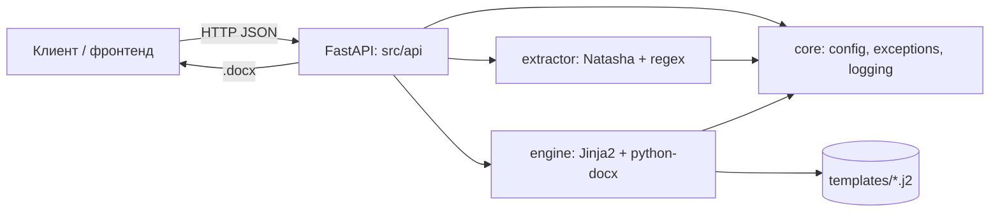

# DocForge

**API для автоматической генерации юридических документов и извлечения сущностей из текста судебных решений.**

[](https://github.com/legalops-toolkit/docforge/actions/workflows/ci.yml)
[](LICENSE)
[](.python-version)
[](https://fastapi.tiangolo.com/)
[](https://github.com/astral-sh/ruff)

---

## Обзор

DocForge принимает структурированные данные (истец, ответчик, сумма, номер
дела) и генерирует готовые `.docx`-документы: исковое заявление,
апелляционную жалобу, договор оказания услуг. Отдельный эндпоинт умеет
извлекать эти данные из сырого текста судебного решения (NER на Natasha +
regex-правила для номеров дел, сумм, судов).

## Архитектура



Слои строго однонаправленные: `api → engine / extractor → core`. Нижние
слои никогда не импортируют `api`.

## Возможности

| Функция | Статус |
|---|---|
| Генерация искового заявления (.docx) | ✅ |
| Генерация апелляционной жалобы (.docx) | ✅ |
| Генерация договора оказания услуг (.docx) | ✅ |
| Извлечение сущностей из текста решения | ✅ |
| Строгая проверка шаблонов (StrictUndefined) | ✅ |
| Защита от path traversal в шаблонах | ✅ |
| Лимит размера запроса / длины текста | ✅ |
| Rate limiting per API-key / per IP | ✅ |
| Опциональная аутентификация по X-API-Key | ✅ |
| Структурированное логирование | ✅ |
| Конфигурация через ENV (pydantic-settings) | ✅ |
| OpenAPI-схема с примерами (`/docs`) | ✅ |
| Docker (multi-stage, non-root) | ✅ |
| CI: ruff + mypy + pytest + coverage + docker build | ✅ |
| Деплой на Render / Railway / Fly.io | ✅ |
| Многоязычные шаблоны документов | 🗺️ в планах |
| Хранилище сгенерированных документов (S3) | 🗺️ в планах |

## Быстрый старт

```bash
git clone https://github.com/legalops-toolkit/docforge.git
cd docforge
make dev      # зависимости + pre-commit
make test     # тесты с покрытием
make run      # http://localhost:8000/docs
```

### Docker

```bash
make docker-build
make docker-up
# или напрямую:
docker build -t docforge .
docker run -p 8000:8000 docforge
```

### Render

Репозиторий содержит `render.yaml` (Blueprint). При подключении репозитория
Render автоматически применит:

- **Build command:** `pip install --upgrade pip && pip install -r requirements.txt`
- **Start command:** `uvicorn src.api.main:app --host 0.0.0.0 --port $PORT`
- **Python version:** `3.11.9` (через `PYTHON_VERSION` и `runtime.txt`)
- **Health check:** `/health`

### Railway

Railway читает `Procfile`:

```
web: uvicorn src.api.main:app --host 0.0.0.0 --port $PORT
```
Достаточно подключить репозиторий — Nixpacks определит Python-проект и
использует `runtime.txt`/`.python-version` для версии интерпретатора.

### Fly.io

```bash
fly launch --no-deploy   # подхватит fly.toml и Dockerfile
fly deploy
```

## Примеры API

```bash
curl -X POST http://localhost:8000/extract \
  -H "Content-Type: application/json" \
  -d '{"text": "Арбитражный суд города Москвы рассмотрел дело № А40-12345/2024..."}'
```

```bash
curl -X POST http://localhost:8000/generate/claim \
  -H "Content-Type: application/json" \
  -d '{
        "plaintiff": "ООО «Ромашка»",
        "defendant": "Иванов Иван Иванович",
        "claim_amount": 500000,
        "case_number": "А40-12345/2024"
      }' \
  --output iskovoe_zayavlenie.docx
```

```bash
curl -X POST http://localhost:8000/generate/contract \
  -H "Content-Type: application/json" \
  -d '{
        "customer": "ООО «Ромашка»",
        "contractor": "ИП Иванов Иван Иванович",
        "contract_amount": 500000,
        "contract_number": "Д-2026-014"
      }' \
  --output dogovor.docx
```

Полная интерактивная документация — на `/docs` (Swagger UI) и `/redoc`.
Получить актуальную OpenAPI-схему без поднятия сервера:

```bash
python -c "from src.api.main import app; import json; print(json.dumps(app.openapi(), ensure_ascii=False, indent=2))" > openapi.json
```

## Структура проекта

```
docforge/
├── src/
│   ├── api/          # FastAPI: main.py, dependencies.py
│   ├── engine/        # Генератор документов (Jinja2 → .docx)
│   ├── extractor/     # NER + regex извлечение сущностей
│   └── core/          # config (ENV), exceptions, logging
├── templates/          # Jinja2-шаблоны документов
├── tests/               # pytest, >90% покрытия
├── frontend/             # Статический веб-интерфейс (не зависит от src/,
│                         # говорит с API по HTTP — см. frontend/README ниже)
├── data/                 # пример текста решения
├── scripts/               # check_deps_sync.py и другие CI-скрипты
├── main.py               # тонкая точка входа в корне (реэкспорт app)
├── Dockerfile             # multi-stage, non-root (образ бэкенда, без frontend/)
├── render.yaml            # Render Blueprint
├── fly.toml               # Fly.io конфигурация
├── Procfile               # Railway / Heroku-style старт-команда
├── runtime.txt            # версия Python для Render
└── .github/workflows/     # CI + Release
```

### Frontend

`frontend/` — самостоятельный статический сайт (без сборки, без Node):
`frontend/index.html` + `frontend/css/*` + `frontend/js/*`. Обращается к
API по адресу, заданному в `frontend/js/api.js` (`API_BASE`) — задеплойте
его отдельно (Cloudflare Pages, Netlify, GitHub Pages) и укажите там домен
бэкенда. `Dockerfile` бэкенда его не копирует и не отдаёт — это осознанно
раздельные деплойменты.


## Конфигурация

Все переменные — с префиксом `DOCFORGE_`, см. `.env.example`.

| Переменная | По умолчанию | Описание |
|---|---|---|
| `DOCFORGE_ENVIRONMENT` | `development` | `development` \| `testing` \| `production` |
| `DOCFORGE_LOG_LEVEL` | `INFO` | Уровень логирования |
| `DOCFORGE_DEFAULT_COURT` | `Арбитражный суд г. Москвы` | Суд по умолчанию для исков |
| `DOCFORGE_DEFAULT_LEGAL_ARTICLES` | `309, 310, 395 ГК РФ` | Статьи по умолчанию |
| `DOCFORGE_MAX_EXTRACTION_TEXT_LENGTH` | `50000` | Лимит длины текста для `/extract` |
| `DOCFORGE_MAX_REQUEST_BODY_BYTES` | `1048576` | Лимит размера тела запроса |
| `DOCFORGE_RATE_LIMIT` | `60/minute` | Лимит запросов (формат `N/minute`, `N/second`) |
| `DOCFORGE_API_KEYS` | *(пусто)* | Через запятую. Пусто = аутентификация выключена |

## Аутентификация и rate limiting

По умолчанию аутентификация выключена (`DOCFORGE_API_KEYS` пуст) — подходит
для демо/портфолио-деплоя. Чтобы включить: задайте `DOCFORGE_API_KEYS=key1,key2`
— тогда `/extract` и `/generate/*` начнут требовать заголовок `X-API-Key`:

```bash
curl -X POST http://localhost:8000/extract \
  -H "X-API-Key: key1" \
  -H "Content-Type: application/json" \
  -d '{"text": "..."}'
```

Rate limit (`DOCFORGE_RATE_LIMIT`, по умолчанию `60/minute`) считается per
API-key, если ключ передан, иначе per IP — так что при включённой
аутентификации у каждого клиента свой независимый лимит.

## Security

Что уже сделано на уровне кода, не полагаясь на инфраструктуру вокруг:

- **Ни один ответ клиенту не содержит `str(exc)`, traceback или абсолютных
  путей файловой системы сервера** — ни в каком `DOCFORGE_ENVIRONMENT`,
  включая `development`. Обработчик необработанных исключений
  (`api/main.py`) всегда возвращает generic `{"error": "Internal server
  error"}`; доменные ошибки (`TemplateNotFoundError`, `GenerationError`)
  формулируются безопасно для показа клиенту с самого места, где рождаются.
  Полная детализация (путь, traceback, текст внутреннего исключения) уходит
  только в лог через `logger.warning`/`logger.exception`.
- **Сравнение `X-API-Key` — constant-time** (`hmac.compare_digest`), а не
  обычное `==`/`in`, которое в теории уязвимо к timing-атаке.
- **Path traversal при загрузке шаблонов** заблокирован на уровне
  `DocumentGenerator._render_template`: имя шаблона нормализуется через
  `Path(...).name`, проверяется на выход за пределы `templates_dir` — даже
  если вызывающий код когда-нибудь передаст `template_name` не из
  захардкоженного набора.
- **Тело запроса ограничено** (`DOCFORGE_MAX_REQUEST_BODY_BYTES`, 1 MiB по
  умолчанию) через middleware — защита от переполнения NER-пайплайна на
  `/extract` многомегабайтным текстом.
- **`pyproject.toml` и `requirements.txt` проверяются на синхронность в CI**
  (`scripts/check_deps_sync.py`) — версии зависимостей не могут незаметно
  разойтись между источником правды для разработки и рантайм-образом.

Если находите проблему безопасности — заведите issue с меткой `security`
или напишите напрямую контактам из `pyproject.toml`; пожалуйста, не
публикуйте эксплуатируемые детали в публичном issue до фикса.

## Тестирование

```bash
make test        # pytest -v
make coverage     # + HTML-отчёт в htmlcov/
```

Порог покрытия — 90% (`--cov-fail-under=90` в `pyproject.toml`), CI падает,
если он не достигнут.

## Roadmap

- [ ] Хранилище сгенерированных документов (S3-совместимое)
- [ ] Экспорт в PDF наряду с .docx
- [ ] Кастомизируемые шаблоны через API (не только файлы в `templates/`)
- [ ] Rate limiting на уровне API-ключа

## FAQ

**Почему структура `src/`, а не плоский пакет в корне?**
Изолирует исходный код от конфигов/тестов, стандартная практика для
production-пакетов, упрощает `pyproject.toml`-based сборку.

**Почему `main.py` есть и в корне, и в `src/api/`?**
В `src/api/main.py` — вся логика. Корневой `main.py` — только реэкспорт
`app`, для платформ/инструментов, которые ищут `main:app` в корне репозитория.

**Как поменять шаблон документа?**
Отредактируйте соответствующий `.j2`-файл в `templates/`. Если добавляете
новую переменную — она обязана передаваться из `api/main.py`, иначе
`StrictUndefined` вызовет ошибку рендера (сделано намеренно).

## Troubleshooting

**Render: `metadata-generation-failed` при сборке `pydantic-core`.**
Значит платформа выбрала неподдерживаемую версию Python (например 3.14),
для которой ещё нет готового wheel. Убедитесь, что `runtime.txt` содержит
`python-3.11.9` и переменная `PYTHON_VERSION=3.11.9` задана в настройках
сервиса — так и должно быть из коробки в этом репозитории.

**Docker build падает на `pip install`.**
Проверьте, что используете `Dockerfile` из этого репозитория (multi-stage,
base image `python:3.11-slim`) — версия Python зафиксирована в самом образе.

**`StrictUndefined: 'x' is undefined` при генерации документа.**
Шаблон ожидает переменную, которая не передана в `api/main.py`. Это
осознанное поведение — лучше explicit-ошибка, чем пустое поле в юридическом
документе.

## Contributing

См. [CONTRIBUTING.md](CONTRIBUTING.md) и [CODE_OF_CONDUCT.md](CODE_OF_CONDUCT.md).
Об уязвимостях — см. [SECURITY.md](SECURITY.md).

## License

[MIT](LICENSE)
